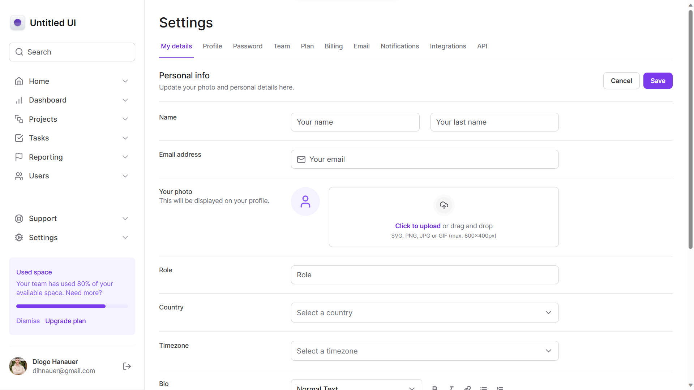
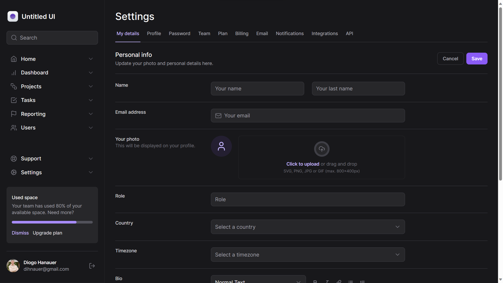

<h1 align="center">Untitled UI</h1>

Dashboard desenvolvida como prática de estudos de TailwindCSS

  <a href="#-projeto">Projeto</a>
  &nbsp;&nbsp;&nbsp;|&nbsp;&nbsp;&nbsp;
  <a href="#-tecnologias">Tecnologias</a>

 

  

  

 
 

## 💻 Projeto

O projeto se baseia em uma dashboard administrativa onde o usuário pode fazer upload da sua imagem de avatar e fazer upload de arquivos.
Para os arquivos, existem três categorias: `progress`, `complete` e `error`, cada um representará um resultado diferente ao realizar o upload e que podem ser modificados manualmente no código.

 

## 🚀 Tecnologias

Esse projeto foi desenvolvido com as seguintes tecnologias:

- Next.js
- TailwindCSS
- Framer Motion
- Radix UI
- FormKit AutoAnimate
- Lucide React
- Git e GitHub
- Figma
